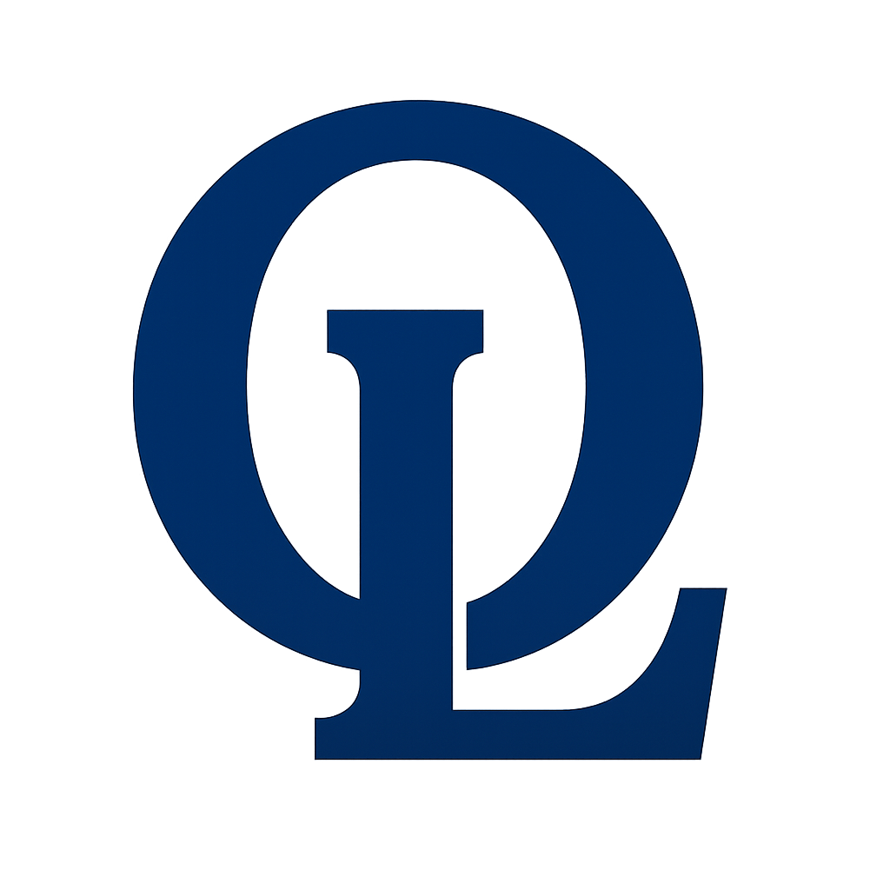

# Omni-Legacy Ltd.

## O.L Ltd. – Company Website



## Table of Contents
1. [Overview](#overview)
2. [About the Company](#about-the-company)
3. [Website Features](#website-features)
4. [Technologies Used](#technologies-used)
5. [Project Structure](#project-structure)
6. [Installation & Setup](#installation--setup)
7. [Deployment](#deployment)
8. [Contributing](#contributing)
9. [Contact](#contact)
10. [License](#license)

---

## Overview
**Omni-Legacy Ltd. (O.L Ltd.)** is a Kenyan IT and software development company providing **innovative technology solutions, IT consultancy, digital transformation and project delivery services**.  
This repository contains the **official website** for O.L Ltd., showcasing our **portfolio, services, projects and contact information** for clients, partners and tenders.

**Website:** [www.omni-legacy.tech](http://www.omni-legacy.tech)  
**Email:** [info@omni-legacy.tech](mailto:info@omni-legacy.tech)  
**Phone:** +254 790 558 956  

---

## About the Company
- **Headquarters:** Nairobi, Kenya  
- **Branches:** Mombasa & Eldoret  
- **Founders:**  
  - Mary M. Muraguri – CEO / Founder / Director (75% Ownership)  
  - Knoph O. Ayieko – CTO / Co-founder / Co-Director (20% Ownership)  
- **Mission:** Deliver robust, scalable and compliant IT solutions for businesses, government and NGOs.  
- **Vision:** Become the leading IT solutions provider in Kenya and East Africa.  
- **Core Values:** Innovation, Integrity, Client Success, Excellence, Scalability  

---

## Website Features
- **Home / Landing Page:** Company introduction, vision, mission, core values and CTA.  
- **About Page:** Company profile, leadership, history, certifications, credibility.  
- **Services Page:** Detailed IT & software development services, scope and “Why Choose O.L Ltd.” section.  
- **Projects / Portfolio Page:** Detailed showcase of IT projects, case studies and outcomes.  
- **Contact Page:** Interactive contact form, maps to HQ & branches, email & phone integration.  
- **Dark / Light Mode:** Accessibility-friendly UI toggle.  
- **Responsive Design:** Works seamlessly on mobile, tablet and desktop devices.  

---

## Technologies Used
- **Frontend:** HTML5, CSS3, JavaScript, React.js  
- **Styling / UI:** Tailwind CSS, Framer Motion animations  
- **Backend (if applicable):** Node.js / PHP / Flask  
- **Database:** MySQL / PostgreSQL / MongoDB  
- **Tools:** Git, GitHub, VS Code, Figma, Postman  
- **Deployment:** Vercel / Netlify / AWS (as per project deployment)  

---

## Project Structure
```
/omni-legacy
├── public/                 # Static assets (images, logos, favicon)
├── src/
│   ├── components/         # Reusable React components
│   │   ├── Header.jsx
│   │   ├── Footer.jsx
│   │   ├── HeroSection.jsx
│   │   └── ProjectCard.jsx
│   ├── pages/              # Pages
│   │   ├── Home.jsx
│   │   ├── About.jsx
│   │   ├── Services.jsx
│   │   ├── Projects.jsx
│   │   └── Contact.jsx
│   └── App.jsx
├── package.json
├── tailwind.config.js
└── README.md
```

---

## Installation & Setup
1. **Clone the repository**
```bash
git clone https://github.com/Knoph1/omni-legacy-website.git
```
2. **Navigate to the project folder**
```bash
cd omni-legacy-website
```
3. **Install dependencies**
```bash
npm install
```
4. **Start the development server**
```bash
npm start
```
5. Open [http://localhost:3000](http://localhost:3000) in your browser  

---

## Deployment
1. **Build for production**
```bash
npm run build
```
2. **Deploy** via Vercel, Netlify or any preferred hosting service.  
3. **Ensure environment variables** (if any) are set in the hosting platform.  

---

## Contributing
We welcome contributions to enhance the website!  
1. Fork the repository  
2. Create a new branch (`git checkout -b feature/branch-name`)  
3. Make your changes and commit (`git commit -m "Description of change"`)  
4. Push to your branch (`git push origin feature/branch-name`)  
5. Open a Pull Request for review  

**Please ensure**:  
- Code is well-documented  
- UI changes maintain responsiveness  
- Accessibility and SEO best practices are followed  

---

## Contact
**Omni-Legacy Ltd. (O.L Ltd.)**  
- **Email:** [info@omni-legacy.tech](mailto:info@omni-legacy.tech)  
- **Phone:** +254 790 558 956  
- **Website:** [www.omni-legacy.tech](http://www.omni-legacy.tech)  
- **HQ:** Nairobi, Kenya  
- **Branches:** Mombasa & Eldoret  

---

## License
This project is **proprietary** and owned by Omni-Legacy Ltd.  
© 2025 Omni-Legacy Ltd. All Rights Reserved.
